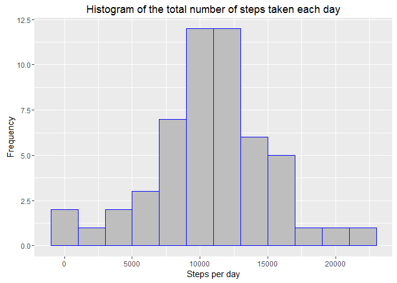
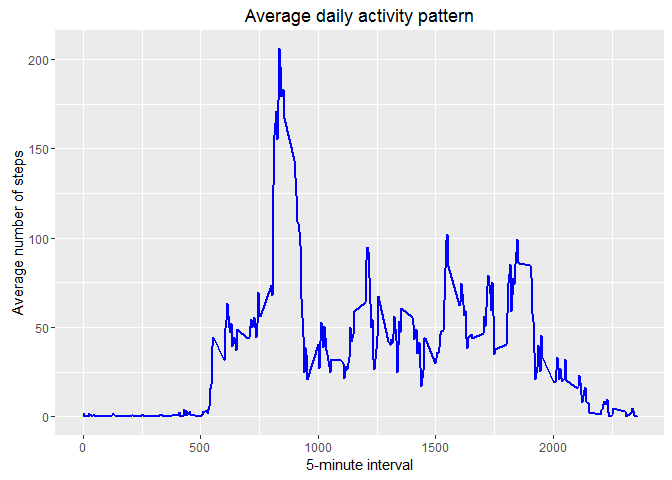
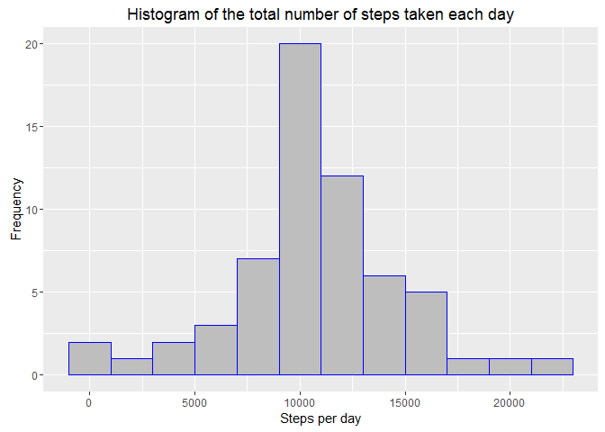
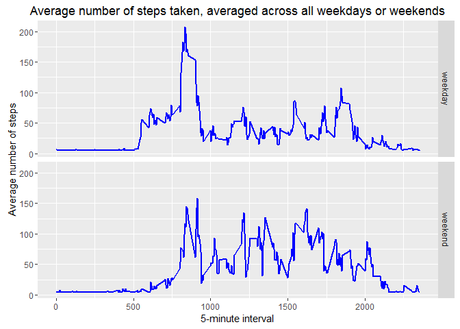

# Course Project 1


# Load libraries

```r
library(ggplot2)
```

# Loading and preprocessing the data

```r
# read the data file
data <- read.csv("activity.csv", stringsAsFactors=FALSE)

# change the date format
data$date <- as.Date(data$date, format="%Y-%m-%d")
```

# What is mean total number of steps taken per day?

```r
# For this part of the assignment, you can ignore the missing values in the dataset.
# Calculate the total number of steps taken per day
stepsPerDay <- aggregate(steps~date, data, sum)
head(stepsPerDay)
```

```
##         date steps
## 1 2012-10-02   126
## 2 2012-10-03 11352
## 3 2012-10-04 12116
## 4 2012-10-05 13294
## 5 2012-10-06 15420
## 6 2012-10-07 11015
```

```r
# Make a histogram of the total number of steps taken each day
# create graph
ggplot(stepsPerDay, aes(x=steps))+
  geom_histogram(color="blue",
                 fill="gray",
                 binwidth=2000)+
  labs(title="Histogram of the total number of steps taken each day",
       x="Steps per day",
       y="Frequency")
```

<!-- -->

```r
# Calculate and report the mean and median of the total number of steps taken per day
meanStepsPerDay <- mean(stepsPerDay$steps, na.rm=TRUE)
medianStepsPerDay <- median(stepsPerDay$steps, na.rm=TRUE)
print(meanStepsPerDay)
```

```
## [1] 10766.19
```

```r
print(medianStepsPerDay)
```

```
## [1] 10765
```

# What is the average daily activity pattern?

```r
# Make a time series plot (i.e. type = "l") of the 5-minute interval (x-axis)
# and the average number of steps taken, averaged across all days (y-axis)
averageStepsPerInterval <- aggregate(steps~interval, data, mean)
head(averageStepsPerInterval)
```

```
##   interval     steps
## 1        0 1.7169811
## 2        5 0.3396226
## 3       10 0.1320755
## 4       15 0.1509434
## 5       20 0.0754717
## 6       25 2.0943396
```

```r
# create graph
ggplot(averageStepsPerInterval, aes(x=interval, y=steps))+
  geom_line(size=1,
            color="blue")+
  labs(title="Average daily activity pattern",
       x="5-minute interval",
       y="Average number of steps")
```

<!-- -->

```r
# Which 5-minute interval, on average across all the days in the dataset,
# contains the maximum number of steps?
maxSteps <- averageStepsPerInterval[which.max(averageStepsPerInterval$steps),]
print(maxSteps)
```

```
##     interval    steps
## 104      835 206.1698
```

```r
# The maximum number of steps is at the 835 interval.
```

# Imputing missing values

```r
# Note that there are a number of days/intervals where there are missing values (coded as NA).
# The presence of missing days may introduce bias into some calculations or summaries of the data.

# Calculate and report the total number of missing values in the dataset (i.e. the total number of rows with NAs)
missingValues <- sum(is.na(data$steps))
print(missingValues)
```

```
## [1] 2304
```

```r
# Devise a strategy for filling in all of the missing values in the dataset.
# The strategy does not need to be sophisticated. For example, you could use
# the mean/median for that day, or the mean for that 5-minute interval, etc.

# all NA values are replaced with the mean value of steps for the 5-minute interval

# Create a new dataset that is equal to the original dataset but with the missing data filled in.
data2 <- data
# calculate the mean
meanSteps5interval <- mean(data$steps, na.rm=TRUE)
# replace NAs with the mean
data2$steps[is.na(data2$steps)] <- meanSteps5interval

# Make a histogram of the total number of steps taken each day and Calculate and report
# the mean and median total number of steps taken per day.
# Do these values differ from the estimates from the first part of the assignment?
# What is the impact of imputing missing data on the estimates of the total daily number of steps?

# copy-paste the code from the first part
# Calculate the total number of steps taken per day
stepsPerDay2 <- aggregate(steps~date, data2, sum)
head(stepsPerDay2)
```

```
##         date    steps
## 1 2012-10-01 10766.19
## 2 2012-10-02   126.00
## 3 2012-10-03 11352.00
## 4 2012-10-04 12116.00
## 5 2012-10-05 13294.00
## 6 2012-10-06 15420.00
```

```r
# Make a histogram of the total number of steps taken each day
# create graph
ggplot(stepsPerDay2, aes(x=steps))+
  geom_histogram(color="blue",
                 fill="gray",
                 binwidth=2000)+
  labs(title="Histogram of the total number of steps taken each day",
       x="Steps per day",
       y="Frequency")
```

<!-- -->

```r
# Calculate and report the mean and median of the total number of steps taken per day
meanStepsPerDay2 <- mean(stepsPerDay2$steps, na.rm=TRUE)
medianStepsPerDay2 <- median(stepsPerDay2$steps, na.rm=TRUE)
print(meanStepsPerDay2)
```

```
## [1] 10766.19
```

```r
print(medianStepsPerDay2)
```

```
## [1] 10766.19
```

```r
# The first mean and median values are mean=10766.19 and median=10765.
# The new (after imputing missing data) are mean=10766.19 and median=10766.19.
# We see a small increase in the median, and that mean and median have the same value.
# The new histogram has increased values at the center (frequency is larger)
# due to the addition of the mean values to NA.
```

# Are there differences in activity patterns between weekdays and weekends?

```r
# For this part the weekdays() function may be of some help here.
# Use the dataset with the filled-in missing values for this part.

# Create a new factor variable in the dataset with two levels - "weekday" and "weekend"
# indicating whether a given date is a weekday or weekend day.
data3 <- data2
# add a new column entitled "dayType"
data3["dayType"] <- NA
# fill the new column with the appropriate variable, if it's Saturday or Sunday
# the variable is "weedend", else is "weekday"
data3$dayType=ifelse(weekdays(data3$date)=="Saturday" | weekdays(data3$date)=="Sunday", "weekend", "weekday")
data3$dayType <- as.factor(data3$dayType)

# Make a panel plot containing a time series plot (i.e. type = "l") of the 5-minute interval (x-axis)
# and the average number of steps taken, averaged across all weekday days or weekend days (y-axis).
# See the README file in the GitHub repository to see an example of what this plot should look like
# using simulated data.
averageByDayType <- aggregate(steps~interval+dayType, data3, mean)
head(averageByDayType)
```

```
##   interval dayType    steps
## 1        0 weekday 7.006569
## 2        5 weekday 5.384347
## 3       10 weekday 5.139902
## 4       15 weekday 5.162124
## 5       20 weekday 5.073235
## 6       25 weekday 6.295458
```

```r
# create graph
ggplot(averageByDayType, aes(x=interval, y=steps))+
  geom_line(size=1,
            color="blue")+
  labs(title="Average number of steps taken, averaged across all weekdays or weekends",
       x="5-minute interval",
       y="Average number of steps")+
  facet_grid(dayType~.)
```

<!-- -->


